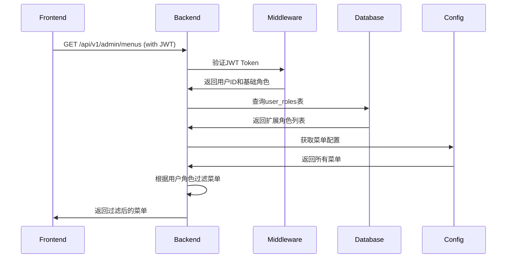

# 菜单权限管理功能文档

## 概述

本系统实现了基于角色的菜单权限管理功能，支持根据用户角色动态展示菜单。菜单配置通过YAML文件管理，支持多级菜单和细粒度的权限控制。

## 主要功能

### 1. 菜单配置

菜单配置文件位于 `/conf/menus.yaml`，支持以下特性：

- **多级菜单**: 支持group（菜单组）和menu（菜单项）两种类型
- **角色权限**: 每个菜单项可配置允许访问的角色列表
- **图标和排序**: 支持自定义图标和排序顺序
- **可见性控制**: 可设置菜单项的可见性和禁用状态

### 2. 支持的角色

系统当前支持以下角色：

- `admin`: 系统管理员（拥有所有权限）
- `brand_admin`: 品牌管理员（管理品牌相关功能）
- `store_admin`: 门店管理员（管理门店相关功能）
- `employer`: 雇主
- `worker`: 打工人

### 3. 角色来源

用户的角色可以来自两个地方：

1. **基础角色**: 来自 `users` 表的 `role` 字段
2. **扩展角色**: 来自 `user_roles` 表的 `role_type` 字段
   - 一个用户可以拥有多个扩展角色
   - 例如：同时是多个品牌的管理员

## API接口

### 获取用户菜单

**接口**: `GET /api/v1/admin/menus`

**请求头**:
```
Authorization: Bearer {access_token}
```

**请求参数**: 无

**响应示例**:
```json
{
  "base": {
    "code": 0,
    "message": "success"
  },
  "menus": [
    {
      "menu_id": "3",
      "name": "brands",
      "label": "品牌管理",
      "icon": "ShopOutlined",
      "parent_id": null,
      "type": "group",
      "sort_order": 3,
      "visible": true,
      "disabled": false,
      "permission": "brands:view",
      "roles": ["admin", "brand_admin"],
      "children": [
        {
          "menu_id": "3-1",
          "name": "brand-list",
          "label": "品牌列表",
          "path": "/admin/brands",
          "icon": "BankOutlined",
          "parent_id": "3",
          "type": "menu",
          "sort_order": 1,
          "visible": true,
          "disabled": false,
          "permission": "brands:list",
          "roles": ["admin"]
        },
        {
          "menu_id": "3-2",
          "name": "brand-staff",
          "label": "品牌人员管理",
          "path": "/admin/brands/staff",
          "icon": "TeamOutlined",
          "parent_id": "3",
          "type": "menu",
          "sort_order": 2,
          "visible": true,
          "disabled": false,
          "permission": "brands:staff",
          "roles": ["admin", "brand_admin"]
        }
      ]
    }
  ]
}
```

## 菜单配置结构

### MenuItem 字段说明

| 字段 | 类型 | 说明 |
|------|------|------|
| menu_id | string | 菜单ID（唯一标识） |
| name | string | 菜单名称（路由名称） |
| label | string | 菜单显示标签 |
| path | string | 菜单路径（仅menu类型） |
| icon | string | 图标名称（Ant Design图标） |
| parent_id | string | 父菜单ID（null表示顶级菜单） |
| type | string | 菜单类型：group、menu、button |
| sort_order | int | 排序顺序（数字越小越靠前） |
| visible | bool | 是否可见 |
| disabled | bool | 是否禁用 |
| permission | string | 权限标识 |
| roles | array | 允许访问的角色列表 |
| children | array | 子菜单列表 |

## 菜单配置示例

```yaml
menus:
  # 系统管理（仅系统管理员）
  - menu_id: "1"
    name: "system"
    label: "系统管理"
    icon: "SettingOutlined"
    parent_id: null
    type: "group"
    sort_order: 1
    visible: true
    disabled: false
    permission: "system:view"
    roles: ["admin"]
    children:
      - menu_id: "1-1"
        name: "admin-list"
        label: "管理员管理"
        path: "/admin/admins"
        icon: "UserOutlined"
        parent_id: "1"
        type: "menu"
        sort_order: 1
        visible: true
        disabled: false
        permission: "admin:list"
        roles: ["admin"]

  # 品牌管理（系统管理员和品牌管理员）
  - menu_id: "3"
    name: "brands"
    label: "品牌管理"
    icon: "ShopOutlined"
    parent_id: null
    type: "group"
    sort_order: 3
    visible: true
    disabled: false
    permission: "brands:view"
    roles: ["admin", "brand_admin"]
    children:
      - menu_id: "3-1"
        name: "brand-list"
        label: "品牌列表"
        path: "/admin/brands"
        icon: "BankOutlined"
        parent_id: "3"
        type: "menu"
        sort_order: 1
        visible: true
        disabled: false
        permission: "brands:list"
        roles: ["admin"]
```

## 权限过滤逻辑

### 1. 角色收集

系统会收集用户的所有角色：
1. 从JWT token中获取基础角色（users.role）
2. 查询user_roles表获取扩展角色（如brand_admin、store_admin）
3. 合并所有角色形成用户角色列表

### 2. 菜单过滤

对配置文件中的每个菜单项：
1. 检查用户是否拥有该菜单要求的任一角色
2. 递归过滤子菜单
3. 如果是group类型且过滤后没有子菜单，则不显示该group

### 3. 特殊规则

- **admin角色**: 拥有最高权限，跳过user_roles查询
- **空roles**: 如果菜单项的roles为空，表示所有人可访问
- **多角色用户**: 用户可以同时拥有多个角色，只要满足其中一个即可访问

## 使用场景

### 场景1：系统管理员

```
用户角色: admin
可见菜单: 所有菜单
```

### 场景2：品牌管理员

```
用户角色: admin (基础) + brand_admin (扩展)
可见菜单: 品牌管理、门店管理、岗位管理等
```

### 场景3：门店管理员

```
用户角色: admin (基础) + store_admin (扩展)
可见菜单: 门店管理、岗位管理等
```

### 场景4：多品牌管理员

```
用户角色: admin (基础) + 多个brand_admin (扩展)
可见菜单: 所有品牌相关菜单
说明: 同一个用户可以管理多个品牌
```

## 配置建议

### 1. 菜单ID规范

- 顶级菜单: "1", "2", "3"...
- 二级菜单: "1-1", "1-2", "3-1"...
- 三级菜单: "1-1-1", "1-1-2"...

### 2. 权限命名规范

- 格式: `资源:操作`
- 示例: 
  - `brands:view` - 查看品牌
  - `brands:list` - 品牌列表
  - `brands:create` - 创建品牌
  - `brands:edit` - 编辑品牌

### 3. 角色配置建议

- 最小权限原则：只授予必要的角色权限
- 分层管理：使用菜单组合理组织功能
- 灵活扩展：新增角色只需修改配置文件

## 相关文件

### 配置文件
- `/conf/menus.yaml` - 菜单配置文件

### 代码文件
- `/config/menu.go` - 菜单配置加载和过滤逻辑
- `/biz/logic/admin/get_menus.go` - 获取菜单业务逻辑
- `/biz/handler/admin/get_menus.go` - 获取菜单HTTP处理器
- `/main.go` - 应用启动时加载菜单配置

### Thrift定义
- `/idls/admin.thrift` - MenuItem和GetMenus接口定义

## 注意事项

1. **配置热更新**: 目前菜单配置在应用启动时加载，修改后需要重启服务
2. **权限校验**: 前端获取菜单只是UI展示控制，后端API仍需独立进行权限校验
3. **角色同步**: 修改用户角色后，需要用户重新登录才能刷新菜单
4. **性能优化**: 菜单配置在内存中缓存，避免每次请求都读取文件

## 扩展开发

### 添加新菜单

1. 编辑 `/conf/menus.yaml`
2. 添加新的菜单项
3. 配置对应的roles
4. 重启应用

### 添加新角色

1. 在 `user_roles` 表的 `role_type` enum中添加新角色
2. 在 `/conf/menus.yaml` 中配置菜单的roles
3. 重新生成代码（如需要）

### 自定义菜单过滤逻辑

修改 `/config/menu.go` 中的 `filterMenuItemByRoles` 函数实现自定义过滤逻辑。

## 示例：完整的菜单获取流程



